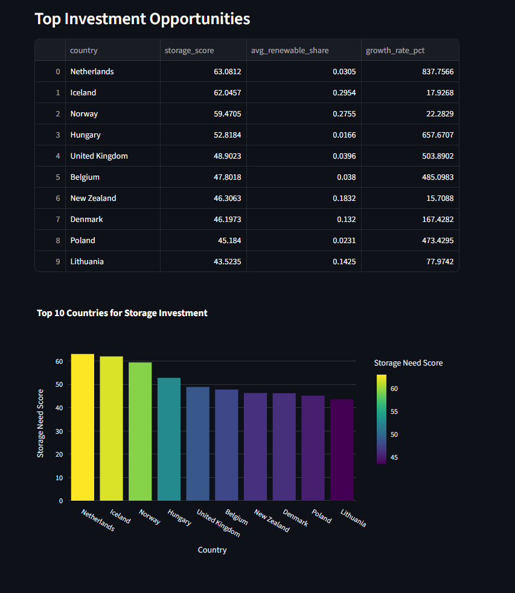

# Renewable Energy Storage Investment Dashboard

A data-driven decision support tool for identifying optimal countries for energy storage infrastructure investments based on renewable energy mix, growth trajectory, and market maturity.

**Live Dashboard:** [Add your Streamlit Cloud URL here]



## Business Problem

Energy storage companies and infrastructure investors need to identify which countries represent the best opportunities for battery storage investments. This dashboard analyzes renewable energy production data across 52 countries (2010-2022) to provide data-driven investment recommendations based on:

- Renewable energy penetration rates
- Growth trajectory over 12+ years
- Energy mix complexity and diversity
- Predicted storage infrastructure needs

## Key Features

### 📊 Investment Opportunity Ranking
- Top 10 countries ranked by composite storage score
- Visual comparison of investment attractiveness
- Based on renewable share, growth rate, and energy diversity

### 🌍 Interactive Country Analysis
- Compare renewable energy metrics across countries
- Visualize energy mix compositions
- Analyze growth trends and production volumes

### 🤖 ML-Powered Predictions
- Interactive prediction tool using Random Forest model
- Input custom renewable energy mix percentages
- Get predicted storage need scores
- Compare predictions to actual country data

### 📈 Technical Documentation
- Complete methodology and data sources
- Model performance metrics (R² = 0.948)
- Preprocessing pipeline details
- Deployment architecture

## Top Investment Opportunities

Based on the analysis, the top 5 countries for storage investment are:

1. **Netherlands** (Score: 63.08) - Exceptional growth rate (838%), emerging market
2. **Iceland** (Score: 62.05) - Highest renewable penetration (29.5%), mature market
3. **Norway** (Score: 59.47) - High penetration (27.5%), stable growth
4. **Hungary** (Score: 52.82) - Strong growth trajectory (658%)
5. **United Kingdom** (Score: 48.90) - Large market, consistent growth (504%)

## Technical Approach

### Data Pipeline
1. **Data Cleaning:** Datetime conversion, missing value handling
2. **Filtering:** Removed aggregate categories, isolated renewable sources
3. **Aggregation:** Country-level totals and time-series data
4. **Feature Engineering:** Calculated renewable mix percentages
5. **Scoring:** Composite metric combining share, growth, and diversity

### Storage Score Formula

```
Storage_Score = 0.4 × Share_normalized + 0.4 × Growth_normalized + 0.2 × Diversity_normalized
```

Where:
- **Share_normalized:** Average renewable energy share (0-1 scale)
- **Growth_normalized:** Production growth rate 2010-2022 (0-1 scale)
- **Diversity_normalized:** Number of renewable types present (0-1 scale)

### Machine Learning Model

- **Algorithm:** Random Forest Regressor
- **Features:** Hydro %, Wind %, Solar %, Geothermal %, Other %
- **Target:** Storage need score (0-100 scale)
- **Performance:** R² = 0.948 on test set
- **Training/Test Split:** 80/20

### Deployment Architecture

Three deployment patterns implemented:
1. **Batch Processing:** 8,033 predictions/second for bulk analysis
2. **REST API:** FastAPI with automatic documentation
3. **Edge Deployment:** 89.4 KB ONNX model for browser/mobile
4. **Interactive Dashboard:** Streamlit Cloud (current deployment)

## Dataset

- **Source:** Global Renewable Energy Production Statistics
- **Time Period:** January 2010 - December 2022 (156 months)
- **Coverage:** 52 countries, 6 renewable energy types
- **Size:** 181,915 records
- **Renewable Types:** Hydro, Wind, Solar, Geothermal, Biofuels, Other

## Project Structure

```
day_19/
├── src/
│   └── dashboard.py           # Streamlit dashboard application
├── data_storage_candidates.csv # Processed country metrics
├── data_clean_renewables.csv   # Cleaned raw data
├── storage_model.pkl           # Trained Random Forest model
├── storage_scaler.pkl          # Feature scaler
├── feature_names.pkl           # Model feature names
├── screenshots/                # Dashboard screenshots
└── README.md
```

## Running Locally

### Prerequisites
- Python 3.8+
- pip package manager

### Installation

1. Clone the repository:
```bash
git clone [your-repo-url]
cd ai_learning_2025/day_19
```

2. Install dependencies:
```bash
pip install -r requirements.txt
```

3. Run the dashboard:
```bash
streamlit run src/dashboard.py
```

4. Open your browser to `http://localhost:8501`

## Requirements

```
streamlit
pandas
plotly>=5.0.0
scikit-learn
numpy
```

## Key Insights

- **Nordic Leadership:** Iceland, Norway lead in renewable penetration (27-30%)
- **Emerging Growth:** Netherlands, Hungary show exceptional growth (650-840%)
- **Market Maturity:** Western Europe dominates top investment opportunities
- **Energy Mix Diversity:** All top countries utilize 5+ renewable sources
- **Storage Correlation:** High renewable share + high growth = highest scores

## Future Enhancements

- [ ] Add time-series forecasting for future production
- [ ] Incorporate grid infrastructure data
- [ ] Add economic factors (electricity prices, subsidies)
- [ ] Real-time data updates via API
- [ ] Multi-language support (Danish, Norwegian, Swedish)
- [ ] Mobile-responsive design improvements

## Technical Stack

- **Frontend:** Streamlit
- **Data Processing:** Pandas, NumPy
- **Visualization:** Plotly Express
- **Machine Learning:** scikit-learn (Random Forest)
- **Model Persistence:** joblib
- **Deployment:** Streamlit Cloud

## About This Project

This project was developed as part of a comprehensive machine learning engineering learning journey, demonstrating:
- End-to-end data science workflow
- Business problem formulation
- Data preprocessing and feature engineering
- Machine learning model development
- Production deployment patterns
- Interactive visualization and stakeholder communication

## Author

David - Systems Engineer transitioning to ML Engineering

**Connect:**
- LinkedIn: www.linkedin.com/in/bean2778
- GitHub: https://github.com/bean2778/ai_learning_2025
- Blog: https://dev.to/dave_bean

## License

This project is available for educational and portfolio purposes.

---

**Project Timeline:** 3 days (Days 19-21 of ML learning roadmap)  
**Status:** Deployed and Production-Ready ✅